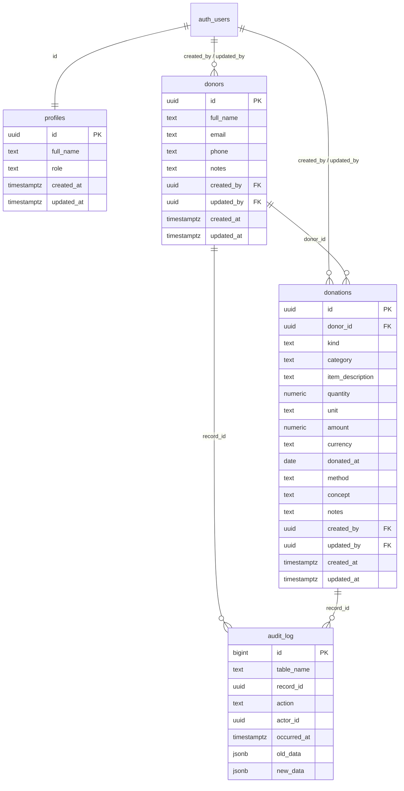

# Modelo de datos — FUNMIAVEN

El sistema nace vacío: no hay migración de donaciones históricas. Los tipos TypeScript se derivan de `src/types/supabase.ts` en `src/types/database.ts`.

## Diccionario de datos

### `profiles`

Extiende `auth.users`. Una fila por usuario autenticado. El trigger `on_auth_user_created` la crea al registrarse.

| Campo | Tipo | Obligatorio | Default | Restricciones y relaciones |
|-------|------|-------------|---------|----------------------------|
| `id` | `uuid` | sí | — | PK. FK a `auth.users(id)` `on delete cascade` |
| `full_name` | `text` | no | — | Viene de `raw_user_meta_data.full_name` al crear el usuario |
| `role` | `text` | sí | `'staff'` | `check`: `'admin'` o `'staff'` |
| `created_at` | `timestamptz` | sí | `now()` | — |
| `updated_at` | `timestamptz` | sí | `now()` | Lo actualiza el trigger `profiles_set_updated_at` |

### `donors`

| Campo | Tipo | Obligatorio | Default | Restricciones y relaciones |
|-------|------|-------------|---------|----------------------------|
| `id` | `uuid` | sí | `gen_random_uuid()` | PK |
| `full_name` | `text` | sí | — | `char_length(btrim(full_name))` entre 1 y 200. Índice único `lower(btrim(full_name))` |
| `email` | `text` | no | — | Máximo 320 caracteres |
| `phone` | `text` | no | — | Máximo 40 caracteres |
| `notes` | `text` | no | — | Máximo 2000 caracteres |
| `created_by` | `uuid` | no | — | FK a `auth.users(id)` `on delete set null`. Lo fija el trigger; no cambia en UPDATE |
| `updated_by` | `uuid` | no | — | FK a `auth.users(id)` `on delete set null`. Lo fija el trigger |
| `created_at` | `timestamptz` | sí | `now()` | No cambia en UPDATE |
| `updated_at` | `timestamptz` | sí | `now()` | Lo actualiza el trigger |

### `donations`

| Campo | Tipo | Obligatorio | Default | Restricciones y relaciones |
|-------|------|-------------|---------|----------------------------|
| `id` | `uuid` | sí | `gen_random_uuid()` | PK |
| `donor_id` | `uuid` | no | — | FK a `donors(id)` `on delete set null` |
| `kind` | `text` | sí | `'money'` | `'money'` (dinero) o `'supplies'` (insumos) |
| `category` | `text` | no | — | FK a `supply_categories(id)`, solo insumos. `null` para dinero o sin categoría |
| `amount` | `numeric(12, 2)` | solo dinero | — | `amount >= 0`. `null` para insumos |
| `currency` | `text` | solo dinero | `'USD'` | Tres letras mayúsculas: `^[A-Z]{3}$`. En insumos enviar `null` explícitamente |
| `item_description` | `text` | solo insumos | — | Descripción de 1 a 200 caracteres. `null` para dinero |
| `quantity` | `numeric(12, 2)` | no | — | Mayor que cero cuando se indica. `null` para dinero |
| `unit` | `text` | si hay cantidad | — | De 1 a 40 caracteres. Cantidad y unidad se indican juntas o ambas quedan en `null` |
| `donated_at` | `date` | sí | `current_date` | `>= 2000-01-01`. El trigger rechaza fechas futuras |
| `method` | `text` | no | — | Máximo 50 caracteres, solo dinero. `En especie` no es un método de pago |
| `concept` | `text` | no | — | Máximo 200 caracteres |
| `notes` | `text` | no | — | Máximo 2000 caracteres |
| `created_by` | `uuid` | no | — | FK a `auth.users(id)` `on delete set null`. Lo fija el trigger; no cambia en UPDATE |
| `updated_by` | `uuid` | no | — | FK a `auth.users(id)` `on delete set null`. Lo fija el trigger |
| `created_at` | `timestamptz` | sí | `now()` | No cambia en UPDATE |
| `updated_at` | `timestamptz` | sí | `now()` | Lo actualiza el trigger |

### `supply_categories`

Catálogo administrable: `id` (text, PK, UUID automática en nuevas categorías), `name` (text, entre 1 y 80 caracteres, único ignorando espacios externos y mayúsculas), `created_at` y `updated_at`. Se incluyen Alimentos, Ropa, Medicinas, Higiene, Útiles escolares y Otros como opciones iniciales. El personal puede agregar categorías y cambiar nombres; no puede modificar IDs ni eliminarlas. RLS permite SELECT/INSERT/UPDATE del nombre a usuarios autenticados; `anon` no ve filas. La vista añade `category_name` mediante un join, conservando el ID al renombrar.

### `audit_log`


`actor_id` no tiene FK para sobrevivir al borrado del usuario. Solo lo escribe el trigger `audit_row_change`.

| Campo | Tipo | Obligatorio | Default | Restricciones y relaciones |
|-------|------|-------------|---------|----------------------------|
| `id` | `bigint` | sí | identity | PK |
| `table_name` | `text` | sí | — | Nombre de la tabla auditada (`donors` o `donations`) |
| `record_id` | `uuid` | sí | — | `id` de la fila afectada |
| `action` | `text` | sí | — | `check`: `'INSERT'`, `'UPDATE'` o `'DELETE'` |
| `actor_id` | `uuid` | no | — | `auth.uid()` en el momento del cambio. Sin FK |
| `occurred_at` | `timestamptz` | sí | `now()` | — |
| `old_data` | `jsonb` | no | — | Fila previa en UPDATE y DELETE |
| `new_data` | `jsonb` | no | — | Fila nueva en INSERT y UPDATE |

## Diagrama ER



`auth.users` vive en el esquema `auth` de Supabase. `profiles.id` es la misma UUID.

## RLS por tabla y rol

`anon` no tiene políticas. `audit_log` solo lo lee un admin; lo escribe el trigger (revocado INSERT/UPDATE/DELETE a `anon` y `authenticated`).

| Tabla / vista | anon | staff (`authenticated`) | admin (`authenticated` + `profiles.role = 'admin'`) |
|---------------|------|-------------------------|-----------------------------------------------------|
| `profiles` | no ve filas | SELECT | igual que staff |
| `donors` | no ve filas | SELECT, INSERT, UPDATE. Sin DELETE | igual que staff |
| `donations` | no ve filas | SELECT, INSERT, UPDATE, DELETE | igual que staff |
| `donation_list` | no ve filas | lee lo que RLS permite en `donations` (vista `security_invoker`) | igual que staff |
| `audit_log` | sin GRANT | GRANT SELECT, pero RLS oculta todas las filas. No puede escribir | SELECT de todas las filas |

Las funciones de consulta (`search_donations`, `donation_summary`, `donation_filter_options`, `ensure_donor`) se ejecutan como `authenticated`. `anon` no tiene `EXECUTE`.

## Triggers y trazabilidad

| Trigger | Tabla | Cuándo | Efecto |
|---------|-------|--------|--------|
| `on_auth_user_created` | `auth.users` | AFTER INSERT | Crea `profiles` con rol `staff` |
| `*_set_updated_at` | `profiles`, `donors`, `donations` | BEFORE UPDATE | `updated_at = now()` |
| `*_set_actor_columns` | `donors`, `donations` | BEFORE INSERT/UPDATE | INSERT: `created_by` y `updated_by` = `auth.uid()`. UPDATE: `updated_by` = `auth.uid()`, conserva `created_by` y `created_at` |
| `donations_check_donation_date` | `donations` | BEFORE INSERT/UPDATE | Rechaza `donated_at` posterior a `current_date` |
| `*_audit_row_change` | `donors`, `donations` | AFTER INSERT/UPDATE/DELETE | Inserta una fila en `audit_log` con el actor (`auth.uid()`), `old_data` y `new_data` |

## Vista y funciones de consulta

### `donation_list`

Vista de `donations` con `donor_name`, `created_by_name` y `updated_by_name` (joins a `donors` y `profiles`). `security_invoker = true`: aplica el RLS del caller.

### `search_donations(p_query, p_currency, p_method, p_from, p_to, p_kind, p_category)`

`p_category` filtra la categoría de insumos; `null` incluye todas. Los filtros de búsqueda y resumen usan la misma consulta.

Devuelve filas de `donation_list`. El texto busca en concepto, método, notas, moneda, nombre del donante, descripción de insumos y unidad (sin comodines: `%` y `_` son literales). `p_kind` admite `money`, `supplies` o `null` (ambos). La moneda compara en mayúsculas; el método, sin distinguir mayúsculas. El rango de fechas es inclusivo.

### `donation_summary(...)`

Mismos filtros que `search_donations`. Devuelve `kind`, `currency`, `total` y `donation_count`. Dinero se agrupa por moneda. Insumos se cuentan por separado con `currency = null` y `total = 0`: no se suman cantidades de artículos ni unidades diferentes.

### `donation_filter_options()`

JSON `{"currencies": [...], "methods": [...]}` con valores distintos, ordenados.

### `ensure_donor(p_full_name)`

Crea o reutiliza un donante por `lower(btrim(full_name))`. Nombre vacío o solo espacios → `null`. Se conserva por compatibilidad, pero el formulario actual usa exclusivamente el ID de una ficha seleccionada; nunca llama a esta función al guardar una donación.

### Ejemplo con supabase-js

```ts
const { data: rows, error } = await supabase.rpc("search_donations", {
  p_query: "útiles",
  p_currency: "USD",
  p_method: "Efectivo",
  p_from: "2026-01-01",
  p_to: "2026-12-31",
});

const { data: summary } = await supabase.rpc("donation_summary", {
  p_query: "útiles",
  p_currency: "USD",
  p_method: null,
  p_from: "2026-01-01",
  p_to: "2026-12-31",
});

const { data: options } = await supabase.rpc("donation_filter_options");

const { data: donorOptions } = await supabase.rpc("search_donors", {
  p_query: "Carmen", p_sort: "name",
}, { count: "exact" }).range(0, 9);
// Al elegir una ficha, su id se guarda como donations.donor_id.

const { data: list } = await supabase
  .from("donation_list")
  .select("id, amount, currency, donor_name, created_by_name")
  .order("donated_at", { ascending: false });
```

## Donantes y resumen de aportes

Se reutiliza `public.donors` como entidad de contacto. El personal autenticado puede registrar y editar nombre, teléfono, correo y notas. El índice de nombre impide duplicados por espacios o mayúsculas. No se elimina un donante desde la interfaz.

`donor_overview` es una vista `security_invoker`: cuenta sus donaciones de dinero e insumos, conserva los totales por moneda y la fecha más reciente. Se calcula desde las donaciones actuales; editar o eliminar una donación actualiza los resultados automáticamente. `search_donors` permite búsqueda literal y orden por frecuencia, importe en una moneda, fecha o nombre. El historial mantiene la relación por `donor_id` al corregir un nombre.

`get_donation_dashboard` devuelve estadísticas generales y rankings de cinco donantes, insumos y categorías. Incluye donaciones anónimas en los totales, pero solo donantes identificados en el ranking. Agrupa insumos por descripción sin mayúsculas ni espacios externos, y por categoría; cuenta registros sin mezclar sus cantidades o unidades. Tanto las vistas como las funciones respetan RLS y solo el personal autenticado tiene acceso a estas consultas.

No se importan registros históricos ni se aplica el seed en producción.

## Cómo correrlo en local

1. `npm run db:start` — levanta Supabase local.
2. `npm run db:reset` — aplica `supabase/migrations/` y `supabase/seed.sql`.
3. `npm run db:test` — corre las pruebas pgTAP en `supabase/tests/database/`.

El seed es solo para desarrollo. Nunca se aplica en producción. La contraseña de los usuarios de prueba está en `supabase/seed.sql`.
