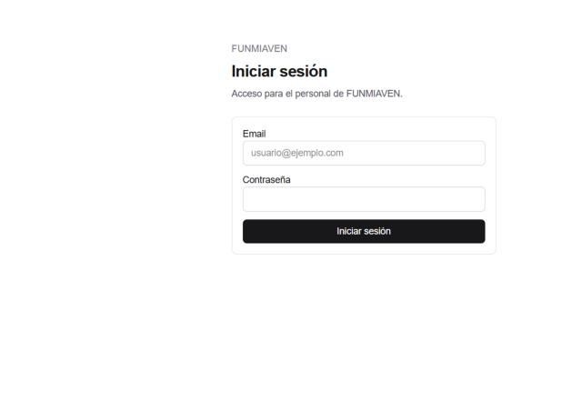
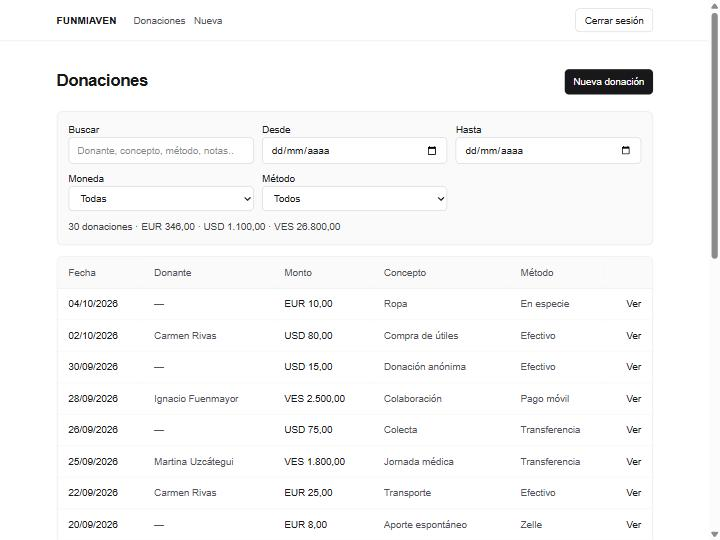
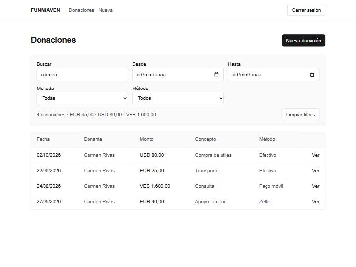
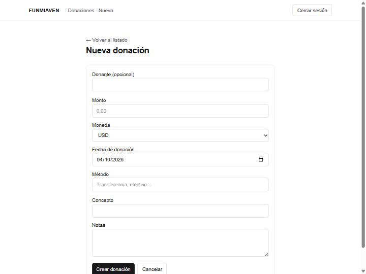
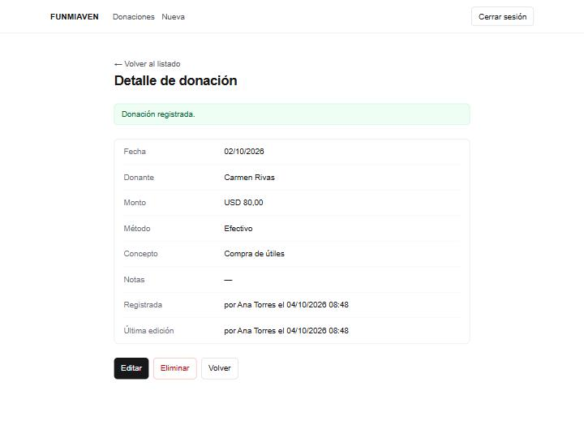
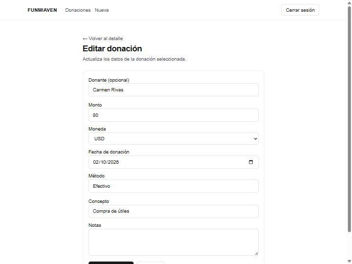

# Manual de uso

Para el personal de FUNMIAVEN. No hace falta saber de informática: solo entrar, registrar y consultar donaciones.

## Entrar y salir

1. Abre la dirección de la app.
2. Escribe tu **Email** y tu **Contraseña**.
3. Pulsa **Iniciar sesión**.

Arriba a la derecha está **Cerrar sesión**. Úsalo al terminar, sobre todo en una computadora compartida.

No hay enlace de “olvidé mi contraseña”. Si no puedes entrar, pide ayuda a quien administra el sistema.

## El listado

Al entrar ves **Donaciones**.

Columnas: **Fecha**, **Donante**, **Monto**, **Concepto**, **Método** y el enlace **Ver**.

Encima de la tabla aparece un resumen: cuántas donaciones hay y el total por cada moneda (por ejemplo `3 donaciones · USD 80,00 · VES 1.600,00`).

Si hay muchas, se muestran de **25 en 25**. Usa **Anterior** y **Siguiente** (verás “Página X de Y”).

**Nueva donación** (arriba a la derecha, o **Nueva** en el menú) abre el formulario.

Si aún no hay nada: `No hay donaciones registradas todavía.`

## Buscar y filtrar

- **Buscar:** donante, concepto, método o notas.
- **Desde** y **Hasta:** rango de fechas de la donación (incluye ambos días).
- **Moneda:** una moneda, o **Todas**.
- **Método:** un método, o **Todos**.
- **Limpiar filtros:** quita todo y vuelve al listado completo.

El resumen y la tabla se actualizan con lo filtrado. Si no coincide nada: `No hay resultados para los filtros aplicados.`

## Registrar una donación

Menú **Nueva** o el botón **Nueva donación**.

| Campo | Qué poner |
|-------|-----------|
| **Donante (opcional)** | Nombre de quien donó. Se puede dejar vacío. Si el nombre ya existe, se reutiliza (no se duplica). La lista sugiere nombres ya cargados. |
| **Monto** | Cantidad. Obligatorio. |
| **Moneda** | USD, VES o EUR. Obligatorio. |
| **Fecha de donación** | Día en que se recibió. No puede ser futura ni anterior al año 2000. |
| **Método** | Cómo se recibió. Hay sugerencias (Efectivo, Transferencia, Pago móvil, Zelle, En especie y las que ya se hayan usado) y también puedes escribir otra cosa. |
| **Concepto** | Para qué fue, si se sabe. |
| **Notas** | Cualquier detalle extra. |

Pulsa **Crear donación**. **Cancelar** vuelve al listado sin guardar.

## Ver el detalle

En el listado, **Ver**.

Verás fecha, donante, monto, método, concepto y notas.

- **Registrada:** quién la cargó y cuándo (`por … el …`).
- **Última edición:** quién la cambió por última vez y cuándo.

Si esa persona ya no está en el sistema, el nombre se reemplaza por `un usuario eliminado`.

Desde aquí: **Editar**, **Eliminar** o **Volver**.

## Editar

En el detalle, **Editar**.

Son los mismos campos que al registrar. Cambia lo necesario y pulsa **Guardar cambios**. **Cancelar** vuelve al detalle sin guardar.

## Eliminar

En el detalle, **Eliminar**. El sistema pregunta:

`¿Eliminar esta donación? Esta acción no se puede deshacer.`

Si confirmas, la donación desaparece del listado. **No se puede deshacer desde la app.** Si fue un error, avisa a quien administra.

## Mensajes

### Al entrar

| Mensaje | Qué hacer |
|---------|-----------|
| `Correo o contraseña incorrectos.` | Revisa email y contraseña. No hay recuperación en la app. |
| `Demasiados intentos. Espera un momento y vuelve a intentar.` | Espera unos minutos e inténtalo de nuevo. |
| `No se pudo conectar con el servidor. Intenta de nuevo.` | Revisa internet. Si sigue, avisa a quien administra. |
| `No se pudo iniciar sesión.` | Inténtalo de nuevo. Si se repite, avisa. |

### En el listado

| Mensaje | Qué hacer |
|---------|-----------|
| `No hay donaciones registradas todavía.` | Aún no hay datos. Usa **Nueva donación**. |
| `No hay resultados para los filtros aplicados.` | Cambia la búsqueda o pulsa **Limpiar filtros**. |
| `No hay resultados en esta página.` | Usa **Anterior** o **Limpiar filtros**. |
| `No se pudieron cargar las donaciones.` | Pulsa **Reintentar**. Si sigue, avisa. |
| `Donación eliminada.` | Confirmación: ya no está en el listado. |

### Al guardar o editar

| Mensaje | Qué hacer |
|---------|-----------|
| `Donación registrada.` | Listo. Ya estás en el detalle. |
| `Cambios guardados.` | Listo. |
| `Ingresa un monto válido.` | Usa un número mayor o igual a 0, con hasta 2 decimales. |
| `Ingresa una moneda de 3 letras.` | Elige USD, VES o EUR. |
| `Ingresa una fecha válida.` | Elige un día en el calendario. |
| `La fecha no puede ser anterior al 2000.` | Usa una fecha desde el 1/1/2000. |
| `La fecha no puede ser futura.` | Usa hoy o un día pasado. |
| `Máximo 50 caracteres.` | Acorta el método. |
| `Máximo 200 caracteres.` | Acorta el concepto o el nombre del donante. |
| `Máximo 2000 caracteres.` | Acorta las notas. |
| `No tienes permiso para esta acción.` | Tu usuario no puede hacer eso. Avisa a quien administra. |
| `Tu sesión expiró. Vuelve a iniciar sesión.` | Cierra sesión si hace falta y vuelve a entrar. |
| `No se pudo guardar. Intenta de nuevo.` | Inténtalo otra vez. Si se repite, avisa. |

### Al eliminar o al abrir un detalle

| Mensaje | Qué hacer |
|---------|-----------|
| `¿Eliminar esta donación? Esta acción no se puede deshacer.` | Confirma solo si estás seguro. |
| `Donación eliminada.` | Ya no está. |
| `No se pudo eliminar. Intenta de nuevo.` | Inténtalo otra vez. Si se repite, avisa. |
| `No se encontró esta donación.` | No existe o la borraron. Vuelve al listado. |

## Preguntas frecuentes

**Olvidé la contraseña. ¿Qué hago?**  
La app no tiene recuperación. Pide a quien administra que te cree el acceso de nuevo.

**¿Puedo dejar el donante vacío?**  
Sí. Queda sin nombre (en el listado se ve un guion).

**Escribí un donante que ya existía. ¿Se duplica?**  
No. Si el nombre es el mismo (da igual mayúsculas o espacios de más), se reutiliza.

**Eliminé una donación por error. ¿La recupero?**  
No desde la app. Avisa de inmediato a quien administra.

**Busqué y no aparece nada.**  
Revisa **Desde**, **Hasta**, **Moneda** y **Método**. Pulsa **Limpiar filtros** y busca otra vez. El listado muestra 25 por página.
