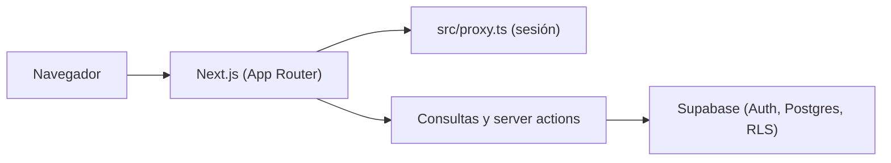

# Documentación técnica

Para quien mantenga el sistema. No inventa comportamiento: describe lo que hay en el repo.

## Arquitectura

- **Next.js 16** (`16.3.0`) con App Router. Las pantallas viven en `src/app/`.
- **`src/proxy.ts`** refresca la sesión de Supabase en cada petición (vía `updateSession` en `src/lib/supabase/proxy.ts`). No autoriza por rol. Si no hay sesión, redirige a `/login`; si hay sesión y se visita `/login`, redirige a `/donations`.
- **`requireUser()`** (`src/lib/supabase/auth.ts`) se llama en el layout protegido (`src/app/(protected)/layout.tsx`) y en cada server action (`createDonation`, `updateDonation`, `deleteDonation`). Si no hay usuario, redirige a `/login`.
- **Consultas solo de servidor** (`src/lib/donations/queries.ts`, `import "server-only"`) y **server actions** (`src/lib/donations/actions.ts`, `"use server"`). El navegador no consulta tablas. El cliente de browser solo se usa para iniciar y cerrar sesión.
- **Supabase**: Auth (email/contraseña), Postgres y RLS. La app usa únicamente `NEXT_PUBLIC_SUPABASE_URL` y `NEXT_PUBLIC_SUPABASE_ANON_KEY`.



## Estructura de carpetas

```
src/app/                      Rutas. layout raíz y /login
src/app/(protected)/          Layout con requireUser() y cabecera. / redirige a /donations
src/app/(protected)/donations Listado, alta, detalle y edición
src/components/               UI: login, listado, filtros, formulario, detalle, sesión
src/lib/donations/            Consultas, actions, filtros, validación
src/lib/supabase/             Clientes server/browser, env, requireUser, refresco de sesión
src/lib/format.ts             Fechas (es-VE / America/Caracas) y montos
src/types/                    Tipos de la base (database.ts sobre supabase.ts)
src/proxy.ts                  Punto de entrada del proxy de Next
supabase/migrations/          SQL de esquema
supabase/tests/database/      Pruebas pgTAP
supabase/seed.sql             Datos falsos solo locales
supabase/config.toml          Auth local: signup público off, email on, clave mín. 8
docs/                         Modelo, contrato, operación, manual y esta guía
```

Rutas de la app: `/login`, `/` → `/donations`, `/donations`, `/donations/new`, `/donations/[id]`, `/donations/[id]/edit`.

## Instalar desde cero (PC nueva)

Requisitos: **Node 20 o más**, **Docker Desktop** (lo usa Supabase local) y **git**.

```bash
git clone https://github.com/SantiagoRiveraO/SC-GestionDonaciones.git
cd SC-GestionDonaciones
npm ci
npm run db:start
npm run db:reset
```

Copia `.env.example` a `.env.local`. De `npx supabase status` toma la URL de la API y la anon key y pónlas como:

- `NEXT_PUBLIC_SUPABASE_URL`
- `NEXT_PUBLIC_SUPABASE_ANON_KEY`

No copies el service role. Luego:

```bash
npm run dev
```

Abre http://localhost:3000. El API local queda en `127.0.0.1:54321` y Postgres en `54322` (ver `supabase/README.md`).

Usuarios de prueba (solo seed local): están en `supabase/seed.sql`.

## Pruebas

| Comando | Qué corre |
|---------|-----------|
| `npm test` | Vitest (`vitest run --passWithNoTests`) |
| `npm run db:test` | pgTAP en `supabase/tests/database/` |
| `npm run lint` | ESLint |
| `npm run build` | Build de Next.js |

## Base de datos

Tablas: `profiles`, `donors`, `donations`, `audit_log`. Vista `donation_list`. Funciones: `search_donations`, `donation_summary`, `donation_filter_options`, `ensure_donor`.

Detalle, RLS y triggers: [`docs/data-model.md`](./data-model.md). Contrato corto: [`docs/data-contract.md`](./data-contract.md).

Migraciones actuales:

- `supabase/migrations/20260804000000_initial_schema.sql`
- `supabase/migrations/20261003000000_rls_and_queries.sql`

Para agregar una migración nueva: `npx supabase migration new nombre_corto` (crea un SQL con prefijo de fecha en `supabase/migrations/`). Escribe el SQL, pruébalo en local con `npm run db:reset` y `npm run db:test`. En producción, `npx supabase db push` (nunca `--include-seed`).

## Seguridad

- La **anon key es pública por diseño**. La protección es RLS: `anon` no ve ni escribe; solo `authenticated` opera. Ver la tabla de políticas en `docs/data-model.md`.
- El **registro público está desactivado** en local (`[auth] enable_signup = false` en `supabase/config.toml`). En el panel de producción hay que dejarlo igual.
- El **service role nunca va al cliente ni al repo**. `.env.example` trae un placeholder `SUPABASE_SERVICE_ROLE_KEY` que **la app no lee**. No lo rellenes con un valor real.
- **`.env.local` no se sube** (`.gitignore` ignora `.env*` salvo `.env.example`).

## Despliegue

Producción actual:

- **App:** https://sc-gestion-donaciones.vercel.app (proyecto `sc-gestion-donaciones` en Vercel).
- **Base:** proyecto de Supabase "MS servicio comunitario" (`https://vwszdrprqpspqeaowhwd.supabase.co`). Las dos migraciones se aplicaron el 2026-10-04 sin seed, y su historial coincide con `supabase/migrations/`.

### Supabase producción

```bash
npx supabase link --project-ref <ref>
npx supabase db push
```

Nunca `--include-seed`: el seed es solo local.

Ajustes de Auth en el panel (equivalentes a `supabase/config.toml`):

- Desactivar **Allow new users to sign up**.
- Dejar activo el proveedor **Email**.
- **Site URL** = URL de Vercel.
- Contraseñas de **8 caracteres** como mínimo.

### Vercel

Importar el repo. Variables:

- `NEXT_PUBLIC_SUPABASE_URL`
- `NEXT_PUBLIC_SUPABASE_ANON_KEY`

Cada push a `main` despliega (configuración habitual de Vercel; en este repo no hay `vercel.json` ni workflow de GitHub).
